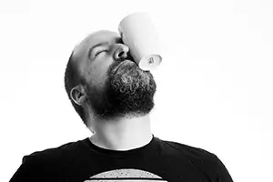

{% assign file_time = site.time | date: '%s' %}


<h1>Javi Aparicio - Photographer</h1>

    <h2>Welcome</h2>
    
Every portrait has a story — let’s tell yours.

    
As a portrait photographer, I’m passionate about capturing the real you. Whether it’s a family moment, a professional headshot, or a creative project, I focus on creating images that reflect your unique personality.

    
What makes my work special isn’t just the photos—it’s the experience. I take the time to get to know you, creating a relaxed environment where your true self can shine. The result? Portraits that you’ll love and moments you’ll want to revisit again and again.

    
Take a look at my <a href="/portraits/">portfolio</a>, and let’s make something amazing together.

    
Javi Aparicio

     
    

     

    <h2>Willkommen</h2>
    
Jedes Porträt erzählt eine Geschichte — lassen Sie uns Ihre erzählen.

    
Als Porträtfotograf ist es meine Leidenschaft, das echte Ich meiner Kunden einzufangen. Ob Familienmoment, professionelles Headshot oder kreatives Projekt—ich konzentriere mich darauf, Bilder zu schaffen, die Ihre einzigartige Persönlichkeit widerspiegeln.

    
Was meine Arbeit besonders macht, sind nicht nur die Fotos—es ist das Erlebnis. Ich nehme mir die Zeit, Sie kennenzulernen und eine entspannte Atmosphäre zu schaffen, in der Ihr wahres Selbst zum Vorschein kommt. Das Ergebnis? Porträts, die Sie lieben werden und Momente, die Sie immer wieder gerne betrachten.

    
Werfen Sie einen Blick in mein <a href="/portraits/">Portfolio</a>, und lassen Sie uns gemeinsam etwas Besonderes schaffen.

    
Javi Aparicio

     
    

     

    <h2>Bienvenido</h2>
    
Cada retrato tiene una historia — contémosla juntos.

    
Como fotógrafo de retratos, me apasiona capturar tu verdadera esencia. Ya sea un momento en familia, un retrato profesional, o un proyecto creativo, me enfoco en crear imágenes que reflejen tu personalidad única.

    
Lo que hace especial mi trabajo no son solo las fotos, sino la experiencia. Me tomo el tiempo de conocerte, creando un ambiente relajado donde tu verdadero ser pueda brillar. El resultado: retratos que te encantarán y momentos que querrás revivir una y otra vez.

    
Echa un vistazo a mi <a href="/portraits/">portafolio</a>, y hagamos algo increíble juntos.

    
Javi Aparicio

